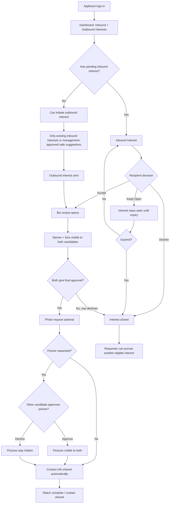

# Interest Management Flow Graph

## Rules Reflected

- Applicants cannot browse profiles that have not shown interest.
- Names and bios become visible only when bio review opens.
- Contact sharing happens automatically after both final approvals.
- Photo decline does not block contact sharing.
- Keep Open expires after a fixed period.
- Each candidate can have only one active bio-review flow at a time.

