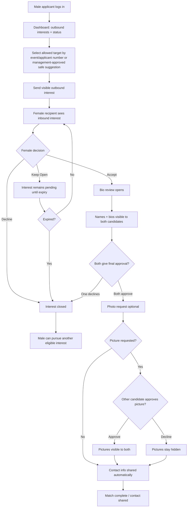
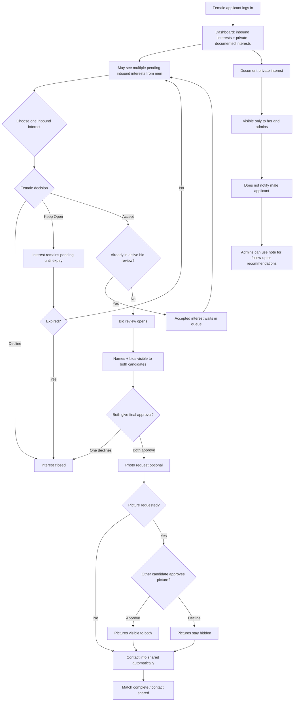

# Interest Management Flow Graphs

## Male Applicant Flow

## Female Applicant Flow

## Rules Reflected

- Visible outbound interests are male-initiated.
- Women may see multiple pending inbound interests from men.
- Women can document private interests that are visible only to themselves and admins.
- Female-documented private interests do not notify men and do not open bio review by themselves.
- Names and bios become visible only when bio review opens.
- Contact sharing happens automatically after both final approvals.
- Photo decline does not block contact sharing.
- Keep Open expires after a fixed period.
- Each candidate can have only one active bio-review flow at a time.

